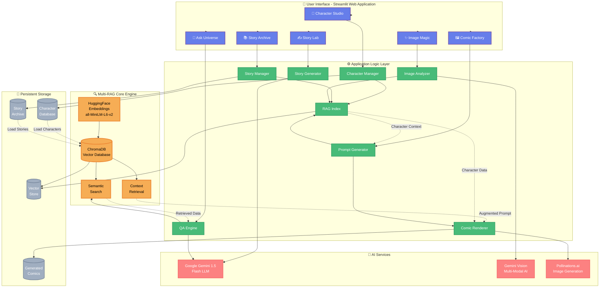

# Gandhinagar Comic AI - System Architecture

## Complete Architecture Diagram



## Architecture Overview

### 🎯 System Layers

#### 1. **User Interface Layer** (Streamlit)
The frontend provides 6 interactive modules:
- **Character Studio**: Create and manage characters
- **Story Lab**: Generate and edit stories
- **Comic Factory**: Produce 6-panel comic strips
- **Ask Universe**: RAG-powered Q&A system
- **Story Archive**: Browse and manage stories
- **Image Magic**: Advanced image generation tools

#### 2. **Application Logic Layer** (Python Modules)
Core business logic modules:
- **Character Manager**: Handles character CRUD operations
- **Story Generator**: Interfaces with Gemini for story creation
- **Prompt Generator**: Creates detailed image prompts
- **Comic Renderer**: Manages image generation pipeline
- **Image Analyzer**: Processes images with Vision AI
- **QA Engine**: Handles question-answering with RAG
- **Story Manager**: Manages story persistence
- **RAG Index**: Maintains vector database

#### 3. **Multi-RAG Core** (The Innovation)
The heart of character consistency:
- **ChromaDB**: Vector database for semantic storage
- **HuggingFace Embeddings**: Converts text to vectors
- **Semantic Search**: Finds relevant characters/stories
- **Context Retrieval**: Augments AI prompts with character data

#### 4. **AI Services Layer**
External AI APIs:
- **Google Gemini 1.5 Flash**: Story generation, Q&A, text processing
- **Gemini Vision**: Image analysis, scene description
- **Pollinations.ai**: High-quality image generation

#### 5. **Persistent Storage Layer**
Data persistence:
- **Character Database**: JSON metadata + reference images
- **Story Archive**: Saved stories with metadata
- **Generated Comics**: PNG comic panels
- **Vector Store**: ChromaDB persistent storage

---

## 🔄 Key Workflows

### Workflow 1: Character Creation
```
User Input → Character Studio → Character Manager → RAG Index → Vector DB → Storage
```
1. User provides character details (name, description, images)
2. Character Manager saves metadata and images
3. RAG Index embeds character data
4. Vector DB stores embeddings for future retrieval

### Workflow 2: Story Generation
```
User Idea → Story Lab → Gemini LLM → Story Text → RAG Index → Archive
```
1. User enters story concept
2. Gemini generates full narrative
3. User reviews and approves
4. Story is indexed in RAG for future reference

### Workflow 3: Comic Generation (Multi-RAG in Action)
```
Story → Prompt Generator → RAG Retrieval → Character Data → Augmented Prompt → Pollinations → Comic Panels
```
1. Approved story is broken into 6 scenes
2. **Prompt Generator identifies characters in each scene**
3. **RAG retrieves character descriptions from Vector DB** ⭐
4. **Prompts are augmented with retrieved character details** ⭐
5. Pollinations generates images with consistent characters
6. Dialogue is overlaid on panels

### Workflow 4: Q&A with RAG
```
User Question → QA Engine → Vector Search → Context Retrieval → Gemini → Answer + Images
```
1. User asks "Who is Kabir?"
2. Question is embedded using HuggingFace
3. **Vector similarity search finds relevant documents** ⭐
4. **Top results are retrieved as context** ⭐
5. Gemini generates answer using retrieved context
6. Character images are displayed

### Workflow 5: Image Magic - Reimagine
```
Upload Image → Gemini Vision → Scene Description → RAG Retrieval → Character Substitution → New Image
```
1. User uploads reference image
2. Gemini Vision analyzes and describes scene
3. User selects characters to use
4. **RAG retrieves selected character descriptions** ⭐
5. New prompt combines scene + character details
6. Pollinations generates reimagined image

---

## 🌟 Multi-RAG Innovation

### The Problem Multi-RAG Solves
Traditional AI image generators have **no memory**. Each generation is independent, causing:
- ❌ Inconsistent character appearance
- ❌ No continuity between panels
- ❌ Manual prompt engineering for each image

### The Multi-RAG Solution
Our system maintains **persistent character memory**:
- ✅ Characters stored in vector database
- ✅ Automatic retrieval based on context
- ✅ Prompts augmented with character details
- ✅ Consistent appearance across all generations

### How RAG Works (Step-by-Step)

#### Storage Phase:
```python
Character Data → HuggingFace Embedding → Vector → ChromaDB
```
Example:
```
"Kabir - Male student, messy hair, school uniform, worried expression"
↓ (Embedding)
[0.23, -0.45, 0.67, ...] (384-dimensional vector)
↓ (Storage)
ChromaDB Vector Database
```

#### Retrieval Phase:
```python
Query → Embedding → Vector Search → Top K Results → Context
```
Example:
```
Query: "Show Kabir running to school"
↓ (Embedding)
[0.21, -0.43, 0.69, ...]
↓ (Similarity Search)
Finds: Kabir's character data (similarity: 0.94)
↓ (Retrieval)
"Kabir - Male student, messy hair, school uniform, worried expression"
```

#### Augmentation Phase:
```python
Base Prompt + Retrieved Context → Augmented Prompt → AI
```
Example:
```
Base: "Student running to school"
+ Retrieved: "Kabir - Male student, messy hair, school uniform, worried expression"
= Augmented: "Kabir (male student with messy hair, school uniform, worried expression) running late to school, morning setting, dynamic action"
```

---

## 🔧 Technical Stack

| Layer | Technology | Purpose |
|-------|-----------|---------|
| **Frontend** | Streamlit | Interactive web interface |
| **Backend** | Python 3.8+ | Application logic |
| **LLM** | Google Gemini 1.5 Flash | Story generation, Q&A |
| **Vision AI** | Google Gemini Vision | Image analysis |
| **Image Gen** | Pollinations.ai | Comic panel generation |
| **Vector DB** | ChromaDB | Semantic storage |
| **Embeddings** | HuggingFace (all-MiniLM-L6-v2) | Text vectorization |
| **Storage** | JSON + File System | Metadata and images |

---

## 📊 Data Flow Summary

```
┌─────────────┐
│    USER     │
└──────┬──────┘
       │
       ▼
┌─────────────────────────────────┐
│   STREAMLIT WEB APPLICATION     │
│  (6 Interactive Features)       │
└──────┬──────────────────────────┘
       │
       ▼
┌─────────────────────────────────┐
│   APPLICATION LOGIC LAYER       │
│  (Python Modules)               │
└──────┬──────────────────────────┘
       │
       ▼
┌─────────────────────────────────┐
│   MULTI-RAG CORE ENGINE    ⭐   │
│  ┌─────────────────────────┐   │
│  │  Vector Search          │   │
│  │  Context Retrieval      │   │
│  │  Prompt Augmentation    │   │
│  └─────────────────────────┘   │
└──────┬──────────────────────────┘
       │
       ├──────────┬──────────┐
       ▼          ▼          ▼
   ┌──────┐  ┌──────┐  ┌──────┐
   │Gemini│  │Vision│  │Pollin│
   │ LLM  │  │  AI  │  │ ations│
   └──────┘  └──────┘  └──────┘
       │          │          │
       └──────────┴──────────┘
                  │
                  ▼
         ┌─────────────────┐
         │ GENERATED OUTPUT│
         │ (Stories/Comics)│
         └─────────────────┘
```

---

## 🎯 Key Features Enabled by Multi-RAG

1. **Character Consistency**: Same character looks identical across all panels
2. **Intelligent Retrieval**: Natural language queries find relevant data
3. **Context-Aware Generation**: AI knows your comic universe
4. **Story Continuity**: Past stories inform future creations
5. **Scalable Memory**: Add unlimited characters and stories

---

This architecture makes Gandhinagar Comic AI the first truly **memory-enabled** comic generation platform! 🚀
