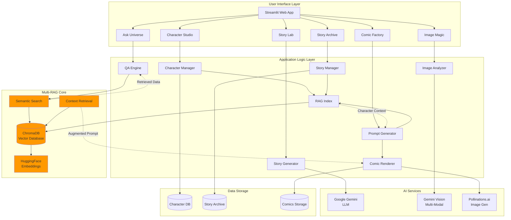

# Architecture Diagram Generation Prompt

## Complete End-to-End Prompt for Gandhinagar Comic AI Architecture

Use this prompt with any AI diagram generation tool (e.g., DALL-E, Midjourney, or diagram.net AI):

---

### PROMPT:

```
Create a detailed, professional system architecture diagram for "Gandhinagar Comic AI - Multi-RAG System" with the following specifications:

LAYOUT: Horizontal flow from left to right, organized in 5 main layers

LAYER 1 - USER INTERFACE (Left side, Purple/Blue theme):
- Streamlit Web Application (main container)
- 6 Feature Modules in a grid:
  * Character Studio (with upload icon)
  * Story Lab (with document icon)
  * Comic Factory (with image grid icon)
  * Ask the Universe (with chat bubble icon)
  * Story Archive (with folder icon)
  * Image Magic (with wand icon)

LAYER 2 - APPLICATION LOGIC (Green theme):
- Character Manager module
- Story Generator module
- Prompt Generator module
- Comic Renderer module
- Image Analyzer module
- QA Engine module
- Story Manager module
- RAG Index module

LAYER 3 - MULTI-RAG CORE (Orange/Yellow theme):
Show a central "Multi-RAG Engine" box containing:
- Vector Database (ChromaDB icon)
- HuggingFace Embeddings (embedding icon)
- Semantic Search Engine
- Context Retrieval System
- Document Indexing Pipeline

DATA FLOW ARROWS showing:
- User input → Application Logic
- Application Logic → Multi-RAG Core (bidirectional)
- Multi-RAG retrieves from Vector DB
- Retrieved context augments AI prompts

LAYER 4 - AI SERVICES (Red/Pink theme):
Three main AI service boxes:
- Google Gemini 1.5 Flash (LLM icon)
  * Story Generation
  * Q&A Responses
  * Prompt Enhancement
  
- Google Gemini Vision (eye icon)
  * Image Analysis
  * Scene Description
  * Image-to-Story

- Pollinations.ai (image icon)
  * Text-to-Image Generation
  * Character Rendering
  * Comic Panel Creation

LAYER 5 - DATA STORAGE (Gray theme):
Bottom layer showing persistent storage:
- Character Database (JSON files + images)
- Story Archive (JSON files)
- ChromaDB Vector Store (database icon)
- Generated Comics (PNG files)
- Metadata Storage

KEY WORKFLOWS (show with colored arrows):
1. CHARACTER CREATION FLOW (Blue arrows):
   User → Character Studio → Character Manager → RAG Index → Vector DB → Character Storage

2. STORY GENERATION FLOW (Green arrows):
   User → Story Lab → Story Generator → Gemini LLM → RAG Retrieval (for characters) → Story Archive

3. COMIC GENERATION FLOW (Purple arrows):
   Story → Prompt Generator → RAG Retrieval (character data) → Comic Renderer → Pollinations API → Comic Storage

4. Q&A FLOW (Orange arrows):
   User Query → QA Engine → Vector Search → Context Retrieval → Gemini LLM → Response + Images

5. IMAGE MAGIC FLOW (Pink arrows):
   User Input → Image Analyzer → Gemini Vision → RAG Retrieval → Pollinations API → Generated Image

SPECIAL HIGHLIGHTS:
- Show "RAG Augmentation" as a glowing connection between Vector DB and AI Services
- Indicate "Character Consistency" with a checkmark badge near the Multi-RAG Core
- Show "Semantic Search" with a magnifying glass icon
- Display "Embedding Pipeline" with vector arrows

ANNOTATIONS:
- Add small text labels explaining:
  * "Multi-Modal Retrieval: Text + Images + Metadata"
  * "Persistent Character Memory"
  * "Context-Aware Generation"
  * "Vector Similarity Search"

STYLE:
- Modern, clean design
- Use rounded rectangles for modules
- Use cylinders for databases
- Use cloud shapes for external APIs
- Professional color scheme (not too bright)
- Clear, readable labels
- Directional arrows with labels
- Legend showing what each color represents

TECHNICAL DETAILS TO INCLUDE:
- "ChromaDB" label on vector database
- "HuggingFace all-MiniLM-L6-v2" on embeddings
- "Streamlit" on frontend
- "Python 3.8+" somewhere visible
- "REST API" on Pollinations connection

Make it look like a professional software architecture diagram suitable for technical documentation and presentations.
```

---

## Alternative Simplified Prompt (For Quick Diagrams):

```
Create a system architecture diagram for an AI comic generation platform with Multi-RAG (Retrieval Augmented Generation):

Components:
1. Frontend: Streamlit app with 6 features (Character Studio, Story Lab, Comic Factory, Q&A, Archive, Image Magic)
2. Backend: Python modules (Character Manager, Story Generator, Comic Renderer, QA Engine, RAG Index)
3. Multi-RAG Core: ChromaDB vector database + HuggingFace embeddings + semantic search
4. AI Services: Google Gemini (LLM + Vision) + Pollinations.ai (image generation)
5. Storage: Character DB, Story Archive, Vector Store, Generated Comics

Show data flow:
- User creates character → stored in vector DB
- User requests story → RAG retrieves character data → LLM generates story with context
- Story → broken into panels → RAG retrieves character details → images generated with consistency
- User asks question → vector search → context retrieval → LLM answers

Highlight: "Multi-RAG ensures character consistency across all generated images"

Style: Professional, modern, color-coded layers, clear arrows showing data flow
```

---

## Mermaid Diagram Code (For GitHub/Documentation):



---

## For Presentation Slides:

```
Create a 3-slide visual representation:

SLIDE 1: "The Problem"
- Show traditional AI image generator creating inconsistent characters
- Character A in panel 1 looks different in panel 2
- Red X marks indicating inconsistency

SLIDE 2: "Multi-RAG Solution"
- Show vector database storing character data
- Retrieval arrows pulling character info
- AI generator receiving augmented prompts
- Green checkmarks showing consistency

SLIDE 3: "Complete Architecture"
- Full system diagram as described in main prompt above
- Highlight the RAG loop: Store → Retrieve → Augment → Generate
```

---

## Usage Instructions:

1. **For AI Image Generators** (DALL-E, Midjourney):
   - Use the "Complete End-to-End Prompt" above
   - May need to split into multiple images for detail

2. **For Diagram Tools** (draw.io, Lucidchart):
   - Use the prompt as a specification guide
   - Build manually following the layer structure

3. **For Documentation** (GitHub, Markdown):
   - Use the Mermaid diagram code
   - Paste directly into README.md

4. **For Presentations**:
   - Use the presentation slide prompt
   - Generate with AI or create in PowerPoint/Keynote

---

## Key Concepts to Visualize:

1. **Multi-RAG Loop**: Store → Retrieve → Augment → Generate
2. **Character Consistency**: Same character data retrieved every time
3. **Semantic Search**: Natural language queries find relevant data
4. **Context Augmentation**: Retrieved data enhances AI prompts
5. **Persistent Memory**: Vector database maintains comic universe

---

Save this file and use the appropriate prompt based on your needs!
